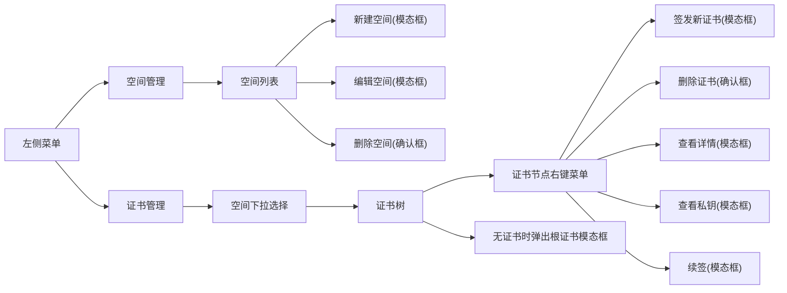

## [查看原型设计](/projects/certmgr)

## 整体布局

- **界面采用左右分栏布局**：
  - **左侧为菜单区域**，风格简洁，仅包含"空间管理"和"证书管理"两个主菜单。
  - **右侧为主内容区**，根据左侧菜单切换显示对应功能界面。

---

## 左侧菜单区域

- **菜单项**：

  1. **空间管理**  
     进入后可对空间进行增删改查等操作。
  2. **证书管理**  
     进入后可对证书进行树状管理和操作。

- **交互细节**：
  - 菜单高亮当前选中项。
  - 菜单点击切换主内容区，无需页面刷新。

---

## 空间管理界面

### 空间列表展示

- 以表格或卡片列表形式展示所有空间。
- 每个空间项显示以下基本信息：
  - 空间名称
  - 创建时间
  - 证书数量
  - 描述（可选）

### 空间操作

- **创建空间**
  - 顶部或列表上方有"新建空间"按钮。
  - 点击后弹出模态框，填写空间名称、描述等信息，确认后创建。
- **编辑空间**
  - 每个空间项有"编辑"按钮，点击后弹出模态框，可修改空间名称、描述等。
- **删除空间**
  - 每个空间项有"删除"按钮，点击后弹出二次确认框，确认后删除该空间及其下所有证书和私钥。
- **刷新列表**
  - 操作完成后自动刷新空间列表。

---

## 证书管理界面

### 空间选择

- 右上方有空间下拉框，列出所有空间。
- 选择空间后，主界面内容切换为该空间下的证书树。

### 证书树展示

- 以树状结构展示当前空间下所有证书，层级分明。
- 每个证书节点以**subject**为主要显示内容。
- 证书树支持多级嵌套（根证书 → 中间证书 → 终端证书）。

### 空状态引导

- 若当前空间下无任何证书，自动弹出"创建根证书"模态框，引导用户创建第一个根证书。

### 证书节点操作（右键菜单）

- 对任意证书节点右键，弹出操作菜单，包含以下功能：
  1. **签发新证书**
     - 弹出模态框，填写新证书信息（如类型、subject、有效期等），确认后签发。
  2. **删除证书**
     - 弹出二次确认框，确认后删除该证书及其下级所有证书。
  3. **查看详情**
     - 弹出模态框，展示证书详细信息（subject、issuer、有效期、指纹、状态等）。
  4. **查看私钥**
     - 弹出模态框，显示私钥内容（可设置权限或二次确认）。
  5. **续签**
     - 弹出模态框，填写续签参数，确认后续签证书。

---

## 通用交互与体验

- **所有创建、编辑、删除等操作均采用模态框**，操作完成后自动刷新相关列表或树。
- **操作反馈**：所有操作均有成功、失败提示，失败时给出明确原因和引导。
- **加载状态**：空间切换、证书树刷新等操作有加载动画或占位符，提升体验。
- **权限与安全**：查看私钥等敏感操作建议二次确认或权限校验。
- **错误处理**：如操作失败，需有明确的错误提示和操作建议。

---

## 流程示意

---

## 界面示意（文字版）

- **左侧菜单**  
  | 空间管理 | 证书管理 |
- **空间管理界面**  
  | 空间名称 | 创建时间 | 证书数量 | 操作（编辑/删除） |
- **证书管理界面**
  - 空间下拉框：[dev ▼]
  - 证书树（subject 展示）
    - Root CA
      - Intermediate CA
        - example.com
        - api.example.com
      - Intermediate CA 2
        - client1
        - client2
  - 右键菜单：签发新证书 | 删除证书 | 查看详情 | 查看私钥 | 续签

---
