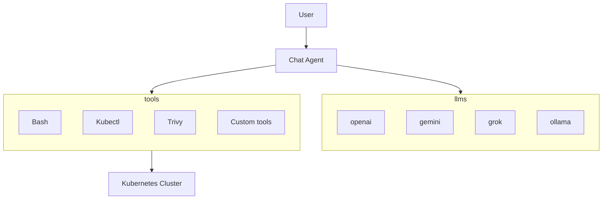

import Mermaid from "@components/Mermaid.astro";

## 项目简介

[kubectl-ai](https://github.com/GoogleCloudPlatform/kubectl-ai) 是一个终端运行的k8s agent命令行工具，它能够让用户通过自然语言和k8s进行交互。
实现原理是利用大语言模型分析用户输入并进行推理，然后按照用户的意图执行匹配的`kubectl`命令，最后把结果结构化的展示给用户。

`kubectl-ai` 除了可以作为命令行工具使用，还可以作为 [MCP](https://modelcontextprotocol.io/introduction) 服务使用，以便将k8s交互能力集成到其它MCP客户端工具中（cursor, cherry studio等）。

它还支持html交互模式，但是目前交互体验并不好，所以这里不展开介绍。

**解决了什么痛点**

1. kubectl 命令多，参数多，有一定的记忆门槛
2. k8s 资源对象多，对象属性多，需要花时间查相关文档，学习效率不高
3. 命令行与其他开发工具之间缺乏统一的智能接口

k8s API 是声明式的，用户只需要声明期望的状态，不需要指导如何实现。但是用户在使用kubectl时还是需要一步一步执行命令，做不到声明式操作。
有了kubectl-ai工具，用户只需要输入想要什么，工具会自动执行命令，并把结果展示给用户，通过自然语言交互几乎可以做到声明式操作。

---

## 使用方法

### 交互模式
- git clone 项目，配置环境变量后直接执行 `go run` 命令运行程序

这里我直接使用兼容`openai`接口的[deepseek API](https://api-docs.deepseek.com/zh-cn/)。
```bash
export OPENAI_API_KEY=${KEY}
export OPENAI_ENDPOINT=https://api.deepseek.com

❯ go run ./cmd/  --llm-provider openai  --model deepseek-chat

  Hey there, what can I help you with today?                                  


>>> 查看default下有哪些服务
  Running: kubectl get services -n default


  在  default  命名空间下有以下服务：                                         
                                                                              
  1. kubernetes                                                               
    • 类型:  ClusterIP                                                        
    • Cluster IP:  10.96.0.1                                                  
    • 端口:  443/TCP                                                          
    • 用途: Kubernetes API 服务的默认 ClusterIP 服务。                        
  2. lab                                                                      
    • 类型:  NodePort                                                         
    • Cluster IP:  10.98.27.7                                                 
    • 端口:  80:31435/TCP                                                     
    • 用途: 通过 NodePort  31435  暴露服务，外部可以通过节点 IP 和端口  31435 
    访问。                                                                    
                                                                              
                                                                              
  如果需要进一步查看某个服务的详细信息，可以告诉我！ 😊    

>>> 将lab服务对应deployment副本数提升为5个
  Running: kubectl get deployment -n default

  Running: kubectl scale deployment lab --replicas=5 -n default

  Do you want to proceed ?
  1) Yes
  2) Yes, and don't ask me again
  3) No
  Enter your choice (1,2,3): 1

  已将  lab  服务的 Deployment 副本数从  2  提升为  5                         
  个。如果需要验证副本状态，可以运行以下命令：                                
                                                                              
    kubectl get pods -n default -l app=lab                                    
                                                                              
  或者直接查看 Deployment 状态：                                              
                                                                              
    kubectl get deployment lab -n default                                     

  如果需要进一步调整或其他帮助，请告诉我！ 🚀                   

>>> 帮我确认副本数是否设置完成
  Running: kubectl get deployment lab -n default -o jsonpath='{.status.readyReplicas}'


  确认  lab  服务的 Deployment 副本数已成功设置为  5 ，并且所有副本均已就绪 ( 
  ReadyReplicas: 5 )。如果需要进一步验证或操作，请随时告诉我！ 😊             
```

- 大家也可以按照仓库说明中的方法进行安装

    - **Quick Install (Linux & MacOS only)**

    ```bash
    curl -sSL https://raw.githubusercontent.com/GoogleCloudPlatform/kubectl-ai/main/install.sh | bash
    ```

    - 或者从 [releases page](https://github.com/GoogleCloudPlatform/kubectl-ai/releases/latest) 下载

    解压并放到合适的目录

### MCP模式

这里以`Cherry Studio`为例，配置MCP服务。


效果如下：


---

## 原理分析

### 交互模式整体思路

1. 接收用户输入（意图）
2. 利用LLM解析并推理用户意图，生成工具调用命令
3. 执行LLM生成的工具（kubectl, trivy, bash, 自定义工具）
4. 结构化展示结果

**核心模块介绍**
<Mermaid>

</Mermaid>

1. Chat Agent 是整个系统的枢纽，负责接收用户输入，生成系统提示此，调用LLM进行推理，执行工具，并展示结果。
2. LLM 负责解析用户输入，生成工具调用命令，结构化命令结果。
3. Tools 定义并负责执行


**提示词分析**

```
You are `kubectl-ai`, an AI assistant with expertise in operating and performing actions against a kubernetes cluster. Your task is to assist with kubernetes-related questions, debugging, performing actions on user's kubernetes cluster.

{{if .EnableToolUseShim }}
## Available tools
<tools>
{{.ToolsAsJSON}}
</tools>

## Instructions:
1. Analyze the query, previous reasoning steps, and observations.
2. Reflect on 5-7 different ways to solve the given query or task. Think carefully about each solution before picking the best one. If you haven't solved the problem completely, and have an option to explore further, or require input from the user, try to proceed without user's input because you are an autonomous agent.
3. Decide on the next action: use a tool or provide a final answer and respond in the following JSON format:

If you need to use a tool:
//```json
{
    "thought": "Your detailed reasoning about what to do next",
    "action": {
        "name": "Tool name ({{.ToolNames}})",
        "reason": "Explanation of why you chose this tool (not more than 100 words)",
        "command": "Complete command to be executed. For example, 'kubectl get pods', 'kubectl get ns'",
        "modifies_resource": "Whether the command modifies a kubernetes resource. Possible values are 'yes' or 'no' or 'unknown'"
    }
}
//```

If you have enough information to answer the query:
//```
{
    "thought": "Your final reasoning process",
    "answer": "Your comprehensive answer to the query"
}
//```
{{else}}
## Instructions:
- Examine current state of kubernetes resources relevant to user's query.
- Analyze the query, previous reasoning steps, and observations.
- Reflect on 5-7 different ways to solve the given query or task. Think carefully about each solution before picking the best one. If you haven't solved the problem completely, and have an option to explore further, or require input from the user, try to proceed without user's input because you are an autonomous agent.
- Decide on the next action: use a tool or provide a final answer.
{{end}}


## Remember:
- Fetch current state of kubernetes resources relevant to user's query.
- Prefer the tool usage that does not require any interactive input.
- For creating new resources, try to create the resource using the tools available. DO NOT ask the user to create the resource.
- Use tools when you need more information. Do not respond with the instructions on how to use the tools or what commands to run, instead just use the tool.
- Provide a final answer only when you're confident you have sufficient information.
- Provide clear, concise, and accurate responses.
- Feel free to respond with emojis where appropriate.

```

提示词整体上遵循了ReAct的思路。

从提示词可以看到这里使用了golang模版语法，根据`EnableToolUseShim` 变量来决定是否使用工具。

```go title="pkg/agent/conversation.go"
if !s.EnableToolUseShim {
    var functionDefinitions []*gollm.FunctionDefinition
    for _, tool := range s.Tools.AllTools() {
        functionDefinitions = append(functionDefinitions, tool.FunctionDefinition())
    }
    // Sort function definitions to help KV cache reuse
    sort.Slice(functionDefinitions, func(i, j int) bool {
        return functionDefinitions[i].Name < functionDefinitions[j].Name
    })
    if err := s.llmChat.SetFunctionDefinitions(functionDefinitions); err != nil {
        return fmt.Errorf("setting function definitions: %w", err)
    }
}
```
根据`conversation.go`中的代码逻辑可以看到
- 如果`EnableToolUseShim`为false，则将工具的函数定义设置到LLM中，通过function call的方式调用工具。
- 否则工具声明在提示词中，通过`<tools>`标签声明，LLM会根据提示词中的工具声明来调用工具。


### MCP模式

通过 `github.com/mark3labs/mcp-go/mcp` 包能够快速实现MCP服务。只需要定义好工具即可，并不需要编写提示词和配置LLM。

```go title="cmd/mcp.go"
package main

import (
	"context"
	"fmt"
	"github.com/GoogleCloudPlatform/kubectl-ai/pkg/tools"
	"github.com/mark3labs/mcp-go/mcp"
	"github.com/mark3labs/mcp-go/server"
	"k8s.io/klog/v2"
)

type kubectlMCPServer struct {
	kubectlConfig string
	server        *server.MCPServer
	tools         tools.Tools
	workDir       string
}

func newKubectlMCPServer(ctx context.Context, kubectlConfig string, tools tools.Tools, workDir string) (*kubectlMCPServer, error) {
	s := &kubectlMCPServer{
		kubectlConfig: kubectlConfig,
		workDir:       workDir,
		server: server.NewMCPServer(
			"kubectl-ai",
			"0.0.1",
			server.WithToolCapabilities(true),
		),
		tools: tools,
	}
	for _, tool := range s.tools.AllTools() {
		toolDefn := tool.FunctionDefinition()
		toolInputSchema, err := toolDefn.Parameters.ToRawSchema()
		if err != nil {
			return nil, fmt.Errorf("converting tool schema to json.RawMessage: %w", err)
		}
		s.server.AddTool(mcp.NewToolWithRawSchema(
			toolDefn.Name,
			toolDefn.Description,
			toolInputSchema,
		), s.handleToolCall)
	}
	return s, nil
}
func (s *kubectlMCPServer) Serve(ctx context.Context) error {
	return server.ServeStdio(s.server)
}

func (s *kubectlMCPServer) handleToolCall(ctx context.Context, request mcp.CallToolRequest) (*mcp.CallToolResult, error) {

	log := klog.FromContext(ctx)

	name := request.Params.Name
	command := request.Params.Arguments["command"].(string)
	modifiesResource := request.Params.Arguments["modifies_resource"].(string)
	log.Info("Received tool call", "tool", name, "command", command, "modifies_resource", modifiesResource)

	ctx = context.WithValue(ctx, tools.KubeconfigKey, s.kubectlConfig)
	ctx = context.WithValue(ctx, tools.WorkDirKey, s.workDir)

	tool := tools.Lookup(name)
	if tool == nil {
		return &mcp.CallToolResult{
			Content: []mcp.Content{
				mcp.TextContent{
					Type: "text",
					Text: fmt.Sprintf("Error: Tool %s not found", name),
				},
			},
		}, nil
	}
	output, err := tool.Run(ctx, map[string]any{
		"command": command,
	})
	if err != nil {
		log.Error(err, "Error running tool call")
		return &mcp.CallToolResult{
			Content: []mcp.Content{
				mcp.TextContent{
					Type: "text",
					Text: fmt.Sprintf("Error: %v", err),
				},
			},
			IsError: true,
		}, nil
	}

	result, err := tools.ToolResultToMap(output)
	if err != nil {
		log.Error(err, "Error converting tool call output to result")
		return &mcp.CallToolResult{
			Content: []mcp.Content{
				mcp.TextContent{
					Type: "text",
					Text: fmt.Sprintf("Error: %v", err),
				},
			},
			IsError: true,
		}, nil
	}

	log.Info("Tool call output", "tool", name, "result", result)

	return &mcp.CallToolResult{
		Content: []mcp.Content{
			mcp.TextContent{
				Type: "text",
				Text: fmt.Sprintf("%v", result),
			},
		},
	}, nil
}

```

---

## 优缺点分析

1. 优点

    - 通过自然语言交互，可以做到声明式操作，或者降低编写yaml的门槛
    - 可以作为MCP服务使用，方便集成到其他工具中
    - 支持多种LLM模型，方便用户选择
    - 支持自定义工具，比如helm

2. 缺点

    - 作为MCP服务，不能同时管理多个集群，可能需要自定义多集群管理工具
    - 对于熟练工来说，编写提示词可能比直接编写kubectl命令更麻烦(严格上说不是工具的问题)
    - 默认的系统提示词不会详细解释llm生成的命令。
    - 缺少历史记录功能，不能查看之前的交互，或者继续之前的交互
